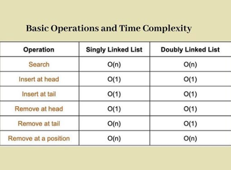
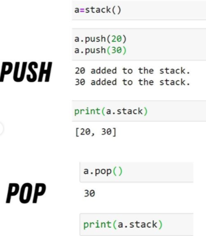
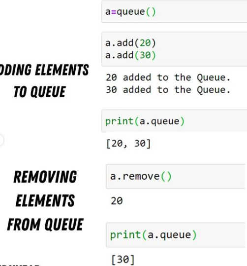

# Data Structures and Algorithms
Data Structures are a crucial part of several computer algorithms as they allow programmers to do data management efficiently. A wise selection of data structures can improve the performance of a computer program or algorithm in a more useful way. ⁣
## Complexity 

### 1. Stack
Stacks are based on the LIFO principle,i.e, The element inserted at the last, is the first element to come out of the list.
- EX.  
class stack:  
```creating an empty list```  
def __init__(self):  
self.stack=[]  
``` adding an element using append```  
def push(self,x):  
self.x=x  
self.stack.append(self.x)  
print(f"{x} added to the stack.")  
``` if list is empty```  
def pop(self):  
if len(self.stack)==0:  
print("Stack Empty")  
```removing the last element using pop```  
else:  
return self.stack.pop( )  



- Stack Push Pop

### 2. Queue Data Structure
A queue is a linear structure which follows a particular order in which the operations are performed. The order is First In First Out(FIFO)
like a one way tunnel
- EX.  
class queue:    
```creating an empty list```  
def __init__(self):  
self.queue=[]  
``` adding an element using append```  
def push(self,x):  
self.x=x  
self.queue.append(self.x)  
print(f"{x} added to the queue.")  
``` if list is empty```  
def pop(self):  
if len(self.queue)==0:  
print("Queue Empty")  
```removing the last element using pop```  
else:  
return self.queue.pop(0)  



- Queue Push Pop

### 3. Linked List Data Structure

In computer science, a linked list is a linear collection of data elements whose order is not given by their physical placement in memory. Instead, each element points to the next.

- Implementation with python  
Start with a node  
``` A single node of a singly linked list ```  
class Node:  
`` constructor ``  
def __init__ (self,data,next=None):  
self.data= data  
self.next=next  
``` creating a single node ```  
first = Node(3)  
print(first.data)  

- Join Nodes to create a linkedList    
``` A single node of a single linked list ```  
class Node:  
`` constructor ``  
df __init__(self,data=None,next=None):  
self.data=data  
self=.next=next  
``` A linked list class with a single head node ```  
class LinkedList:  
def __init__(self):  
self.head = None  
``` Linked List with a single node ```  
LL=LinkedList()  
LL.head=Node(3)  
print(LL.head.data)  

- Add new methods to your LinkedList class  
``` A linked list class with a single head node ```    
class LinkedList:  
def __init__(self):  
self.head = None  
