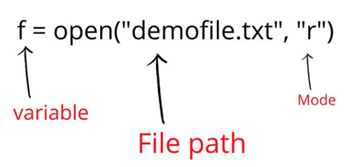

# File Handling in Python
Python has several functions for creating, reading, updating, and deleting files.

## 1. Open()
It is used to open any file, we can open in 4 different modes.
- "r" Read : Default value. Opens a file for reading, error if the file does not exist.
- "a" Append : Opens a file for appending, creates the file if it does not exist.
- "w" Write : Opens a file for writing, creates the file if it does not exist.
- "x" Create : Creates the specified file, returns an error if the file exists.



print(f.read())  
It will print out the data of file  
f.close()  
always close your file after the work is done  

``` It will append the data, the mode is "A" ```

f= open("file.txt","a")  
f.write("appended something")  
f.close()  
- open and read the file after the appending:  
f= open("file.txt","r")  
print(f.read())  

```It will over write the data, the mode is "w" ```

f= open("file.txt","w")  
f.write("Over write the content")  
f.close()  
- open and read the file after the appending:
f= open("file.txt","r")  
print(f.read())  

``` Create a file called "myfile.txt" : ```
f= open("myfile.txt","x")  
