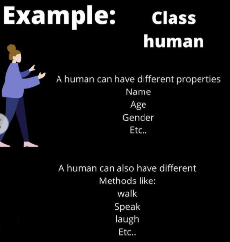
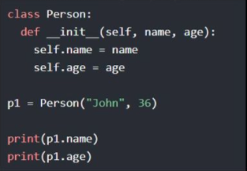
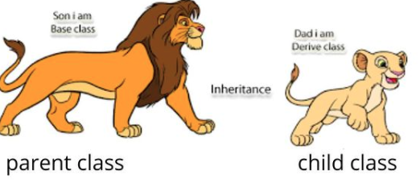
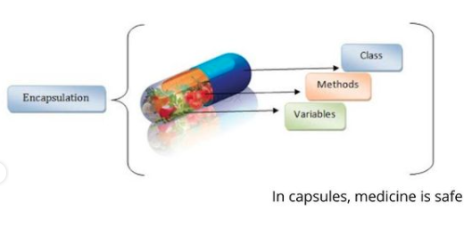

# Pillars of Oop(Object Oriented Programming)

## Class
Almost everything in Pyhton is an object, with  its properties and methods. A Class is like a 'blueprint' for creating objects.
``` class Human: species="Human" ```
We created a class with one property species



   ```__init__(self)```
 All classes have a function called __init__(), which is always executed when the class is being initiated. Use the __init__() function to assign values to object properties.
 


output: John 36 (name and age are properties here)

- Methods 

![Method Example]

### 1. Inheritance 
- Sharing of information
- Base class inherits derive class
- One class acquires the property of another class




### 2. Abstraction
- Hiding of information
- Handles complexity by hiding unnecessary details from the user
- Eg. is like we hide our details at an ATM


### 3. Encapsulation
- Grouping of information
- Binds together the data and functions that manipulate the data, 
- keeps both safe from outside interference and misuse(including class, methods, variables)
- Eg. like in capsules, medicine is safe



### 4. Polymorphism
- Redefining of information
- Ability of an object to take on many forms
- Eg. A man can play diff roles, like doctor for patients, father for son etc


